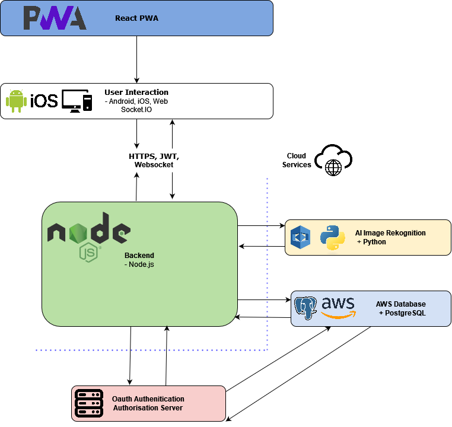

# 2024-CircularMarketplaces

## Table of Contents

- [Project Overview](#project-overview)
- [Features](#features)
- [Project Goals](#project-goals)
- [User Stories](#user-stories)
- [Stakeholders](#Stakeholders)
- [Documentation](#documentation)
- [License](#license)
- [Setup and Deployment](#setup-and-deployment)
- [Acknowledgements](#acknowledgements)
- [Initial Stakeholders](#initial-stakeholders)
- [Team Members](#team-members)
- [Project Structure](#project-structure)
- [Links](#links)
  

## Project Overview

This project aims to transform second-hand marketplaces by harnessing the power of AI to deliver an unparalleled user experience. As part of this initiative, you will develop a dedicated robust app for Android and iOS, enabling users to effortlessly add items they no longer use to the platform. Unlike existing platforms, our vision includes an integrated minimal chatbot that simplifies uploading photos and describing items. Whether a user prefers typing or voice control, the app shall ensure a streamlined, quick and user-friendly experience. Additionally, AI shall be used to classify and tag uploaded photos for precise and efficient searches later by other users, perfectly matching users with the items they seek. Join us in creating a circular marketplace platform that sets new standards for simplicity and efficiency, contributing to reducing waste and fostering greater sharing.

## Features

* User login and profile required for buying and adding new articles
* Articles may be given away for free or at a cost
* Articles may either be shipped by the seller or collected by the buyer
* Articles can be managed through the user’s profile (e.g. edited and deleted)
* (*Publicly available*) iOS and Android App with all implemented functionalities working promptly, reliably and securely on any mobile device.
* ......

## Project Goals

* Protect the environment, someone can keep using the good condition items instead of purchasing a new one.
* As the sellers, they can save up some space and make a small amount of money for their items.

## User Stories

* As a buyer, I want to easily and simply upload items I no longer need, so I can declutter my home and contribute to a sustainable lifestyle
* As a buyer, I want to search for specific items quickly via simple yet powerful search tool, so I can find what I need without searching through irrelevant listings
* As a seller, I want to interact with a chatbot for assistance, so I can get help with uploading items or navigating the app
* As a seller, I want photos of my wares to be easy to find by other users, so I have a better chance of selling them 

  
## Stakeholders

* End Users (Buyers) - Buyers are wish to find unique, second-hand items at low prices in a simple, streamlined environment. They need an efficient search experience with detailed listings and personalized recommendations, as well as secure payment options to ensure safe transactions.
  
* End Users (Sellers) - Sellers want a user-friendly platform that allows them to easily upload and list items they no longer need, helping them declutter their homes. They are looking for clear communication tools to connect with potential buyers as well as a streamlined process for uploading listings.

* Legislators - Since a successful implementation of the system will require potentially identifying personal data to be stored, it must comply with data privacy regulations, especially GDPR. As a result all user data must be handled in a secure and transparent way.

  
## Team Members

| Members           | Email                                                 |
|-------------------|-------------------------------------------------------|
| Lukasz Krepa      | [zr23182@bristol.ac.uk](mailto:zr23182@bristol.ac.uk) |
| Karena Ho         | [iv23220@bristol.ac.uk](mailto:iv23220@bristol.ac.uk) |
| Vojtech Martinat  | [os23060@bristol.ac.uk](mailto:os23060@bristol.ac.uk) |  
| Herman Tsoi       | [ju22521@bristol.ac.uk](mailto:ju22521@bristol.ac.uk) |    

## Project Structure
Main files and directories in dev branch:
  * Directories:
    * Tech Stack (Tech Stack Table, Architecture Chart are included)
    * UI Design (includes a graph provided by our client)
    * MeetingNotes
  * Files:
    * README.md
    * LICENSE
## Links
Main Kanban

https://github.com/orgs/spe-uob/projects/175

Gantt Chart

https://github.com/orgs/spe-uob/projects/215

##Technology Stack Diagram

