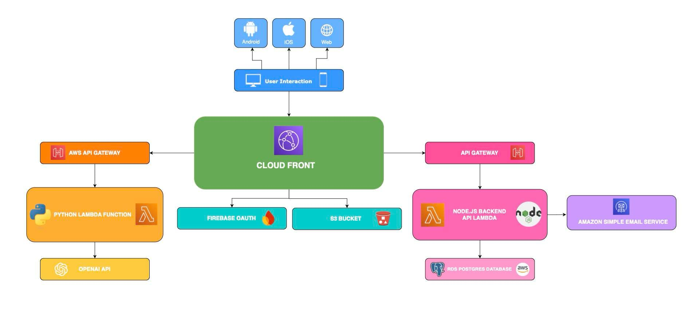

# Circular Marketplace

## Table of Contents

- [Project Overview](#project-overview)
- [Features](#features)
- [Project Goals](#project-goals)
- [User Stories](#user-stories)
- [Stakeholders](#stakeholders)
- [Team Members](#team-members)
- [Project Structure](#project-structure)
- [Database Structure](#database-structure)
- [System Architecture](#system-architecture)
- [Project Setup Guide](#project-setup-guide)

- [Links](#links)

[//]: # (- [Documentation]&#40;#documentation&#41;)

[//]: # (- [License]&#40;#license&#41;)

[//]: # (- [Setup and Deployment]&#40;#setup-and-deployment&#41;)

[//]: # (- [Acknowledgements]&#40;#acknowledgements&#41;)

[//]: # (- [Initial Stakeholders]&#40;#initial-stakeholders&#41;)

## Project Overview

This project aims to transform second-hand marketplaces by harnessing the power of AI to deliver an unparalleled user experience. We developed a dedicated robust web app, enabling users to effortlessly add items they no longer use to the platform. Unlike existing platforms, you simply take an image of your article and our AI will analyse the image and take care of the rest! Join us in creating a circular marketplace platform that sets new standards for simplicity and efficiency, contributing to reducing waste and fostering greater sharing.

## Features

* AI analyses uploaded images to suggest appropriate description, price and title
* User login and profile required for buying and adding new articles
* Articles may be given away for free or at a cost
* Articles may either be shipped by the seller or collected by the buyer
* Articles can be managed through the user’s profile (e.g. edited and deleted)
* Review section under each article being sold
* Chat for each user and their article
* Ability to wishlist articles
* Login via social media account
* Payment implementation
* User wallet function with credit

## Project Goals

* Protect the environment since items can be reused and renewed.
* Provide the seller a quick and convenient way to get rid of items they no longer want, for money.
* Provide the buyer a straightforward way to find the articles they desire.

## User Stories

* As a buyer, I want to easily and simply upload items I no longer need, so I can declutter my home and contribute to a sustainable lifestyle
* As a buyer, I want to search for specific items quickly via simple yet powerful search tool, so I can find what I need without searching through irrelevant listings
* As a seller, I want to interact with a chatbot for assistance, so I can get help with uploading items or navigating the app
* As a seller, I want photos of my wares to be easy to find by other users, so I have a better chance of selling them


## Stakeholders

* End Users (Buyers) - Buyers are wish to find unique, second-hand items at low prices in a simple, streamlined environment. They need an efficient search experience with detailed listings and personalized recommendations, as well as secure payment options to ensure safe transactions.

* End Users (Sellers) - Sellers want a user-friendly platform that allows them to easily upload and list items they no longer need, helping them declutter their homes. They are looking for clear communication tools to connect with potential buyers as well as a streamlined process for uploading listings.

* Legislators - Since a successful implementation of the system will require potentially identifying personal data to be stored, it must comply with data privacy regulations, especially GDPR. As a result all user data must be handled in a secure and transparent way.

## Project Structure
The top-layer project structure can be found below:
```
.
├── .github/                           # GitHub related files
├── docs/                              # Project documentation
├── app/                               # All backend and frontend code
└── **miscellaneous files**            # README, dependencies, gitignore, etc.
```

### Quick Links
Use the following quick links to navigate between explanations of the top level of the repository:
- [./.github](#github)
- [./docs](#docs)
- [./app](#app)

### ./.github
The structure within the ```./.github``` directory can be found below:
```
.
├── ISSUE_TEMPLATE/                    # Templates for GitHub issues 
│   ├── ...
├── workflows/                         # Continuous Integration/Deployment workflows ran via GitHub Actions
│   ├── ...
└── pull_request_template.md           # Template for GitHub pull request
```

#### Quick Links
Use the following quick links to navigate between explanations of the ```.github``` directory:
- [./.github/ISSUE_TEMPLATE](#githubissue_template)
- [./.github/workflows](#githubworkflows)

#### ./.github/ISSUE_TEMPLATE
This directory contains templates that developers/users can fill out under the ```Issues``` section of the GitHub repository. It includes issues specific for new features, or bugs.

#### ./.github/workflows
This directory contains two separate workflows that are ran via GitHub actions:
- ```BackendTestsCI.yml``` - Continuous Integration
    - This workflow is run on all pushes to the ```dev``` branch and pull requests.
    - It runs both the backend testing suites.
- ```DeployBackend.yml``` - Continuous Deployment
    - This workflow is run on all pushes to all branches, and also on any pull requests (before merges).
    - It deploys the app using the AWS lambda service
- ```DeployFrontend.yml``` - Continuous Deployment
    - This workflow is run on all pushes to all branches, and also on any pull requests (before merges).
    - It deploys the app using the AWS lambda service
- ```FrontendTestsCI.yml``` - Continuous Integration
    - This workflow is run on all pushes to the ```dev``` branch and pull requests.
    - It runs both the frontend testing suites.


### ./docs
The structure within the ```./docs``` directory can be found below:
```
.
├── meeting-minutes/                   # Directory holding meeting minutes for important client meetings
│   ├── ...
├── Tech Stack/                          # Contains the iterations of the tech stack
│   ├── ...
├── UI Design/                          # Contains initial UI designs for all pages 
│   ├── ...
└── **miscellaneous files**            # Files including the ethics declaration, readme and testing guidelines etc.
```

### ./app
The structure within the ```./docs``` directory can be found below:
```
.
├── backend/                         # Contains the backend code files
│   ├── ...
├── frontend/                          # Contains the frontend code files
│   ├── ...
├── lambda/                          # Contains the lambda function file to facilitate the calls to the OpenAI API
│   ├── lambda_functions.py
└── **miscellaneous files**            # Files including the dependencies etc.
```

### ./app/backend
The structure within the ```./app/backend``` directory can be found below:
```
.
├── __tests__/                    # Directory holding all the testing suite files. Each file test the routes and the controllers for its model
│   ├── ...
├── config/                           # Directory holding the database setup files
│   ├── ...
├── controllers/                    # Directory holding the controllers for each database model. It defines the actions that can be performed on each model
│   ├── ...
├── database/                           # Directory holding the code for setting up and connecting to the remote database
│   ├── ...
├── errors/                    # Directory holding error API setup code
│   ├── ...
├── middleware/                           # Directory holding error handing and wrapper code
│   ├── ...
├── models/                    # Directory holding the code that sets up and defines the database models. Each model has its own file
│   ├── ...
├── routes/                           # Directory holding code that defines the API routes
│   ├── ...
└── **miscellaneous files**            # dependencies, server file etc.
```


### ./app/frontend
The structure within the ```./app/frontend``` directory can be found below:
```
.
├── public/                             # Directory holding the favicon file
│   ├── ...
├── src/                                # Directory holding the frontend react code
│   ├── ...                            
└── **miscellaneous files**            # dependencies, etc.
```

### ./app/frontend/public
The structure within the ```./app/frontend/public``` directory can be found below:
```
.
├── Components/                 # Directory holding a file for each the pages of the frontend and its associated functions, as well as their styling.  
│   ├── ...
├── Config/                     # Directory holding the file that points the frontend to the backend address
│   ├── ...                            
├── Contexts/                     # Directory holding the code for the user login status
│   ├── ...                            
├── __tests__/                     # Directory holding the tests for main frontend pages. Each test checks whether the page content renders
│   ├── ...                            
├── services/                     # Directory holding the code for fetching data from the database for each model
│   ├── ...                            
└── **miscellaneous files**            # the main App.js file, the test setup and logo vector etc.
```

## Database Structure
Find the database structure UML diagram below:


## System Architecture



# Project Setup Guide

## 1. Install Git (if not already installed)

- **For Ubuntu/Linux:**
  ```bash
  sudo apt update
  sudo apt install git
  ```

- **For macOS:**
  ```bash
  brew install git
  ```

- **For Windows:**
  [Download and install Git](https://git-scm.com/download/win).

---

## 2. Install Node.js 18 (if not already installed)

- **For Ubuntu/Linux:**
  ```bash
  curl -fsSL https://deb.nodesource.com/setup_18.x | sudo -E bash -
  sudo apt-get install -y nodejs
  ```

- **For macOS:**
  Install via Homebrew:
  ```bash
  brew install node@18
  ```

- **For Windows:**
  [Download Node.js 18.x installer](https://nodejs.org/en/download/).

---

## 3. Initialize Git Repository

1. Navigate to your project folder.
2. Run:
   ```bash
   git init
   ```

---

## 4. Clone Repository

To clone a Git repository:
```bash
git clone <repository-url>
```

---

## 5. Backend Setup

1. Navigate to the backend folder:
   ```bash
   cd app/backend
   ```

2. Install required packages (with `sudo` to install `nodemon` and `pm2` globally):
   ```bash
   sudo npm install
   ```

3. Set environment variables:
   ```bash
   export DB_USER=<your-db-username>
   export DB_PASS=<your-db-password>
   ```

4. **Launch the Backend**
    - **For Development and Production:**  
      Start the server with PM2:
      ```bash
      pm2 start server.js
      ```
    - **Stop the Backend:**  
      Stop all PM2 processes:
      ```bash
      pm2 stop all
      ```

    - **For Testing:**  
      Use `nodemon` to automatically restart the server on code changes:
      ```bash
      nodemon
      ```
    - **Stop Testing:**  
      Press `Ctrl + C` to stop.

---

## 6. Frontend Setup

1. Navigate to the frontend folder:
   ```bash
   cd app/frontend
   ```

2. Install dependencies:
   ```bash
   npm install
   ```

3. **Configure Backend URL**  
   Edit the backend URL in `src/Config/config.js` to point to your local backend (e.g., `http://localhost:8080/api/v1/`).

4. **Set Environment Variables**
   ```bash
   export REACT_APP_FIREBASE_API=<your-REACT-APP-FIREBASE-API>
   export REACT_APP_FIREBASE_APP_ID=<your-REACT-APP-FIREBASE-APP-ID>
   ```
5. **Launch the Frontend**
    - **For Development and Testing:**  
      Start the frontend locally:
      ```bash
      npm start
      ```

    - **For Production:**  
      Build the frontend and run it using PM2:
      ```bash
      npm run build
      pm2 start npm --name "react-dev" -- start
      ```

    - **Stop the Frontend:**  
      Stop the PM2 process:
      ```bash
      pm2 stop all
      ```

---

## Links
Main Kanban

https://github.com/orgs/spe-uob/projects/175

Gantt Chart

https://github.com/orgs/spe-uob/projects/215

